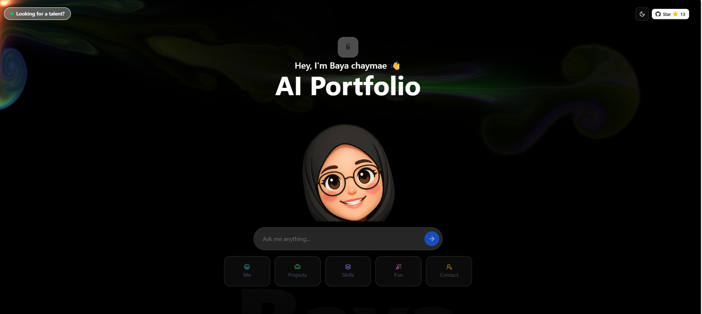

<div align="center">

  <br />
  <p>
    <a href=></a>
  </p>
  <br />

  <h1>🌐 World's First AI-Native Portfolio 🤖✨</h1>
</div>

---


### **About The Project** 💡

Traditional portfolios are static — they show projects but don’t show how an engineer thinks.

I built this AI-powered interactive portfolio to change that.

Instead of scrolling through information, visitors can ask questions and explore my work in AI, embedded systems, computer vision, and robotics through a dynamic conversation.

It’s not just a portfolio —
it’s a live demonstration of how I design intelligent systems. 🚀
---

### **Features** ✨

🤖 Interactive AI Assistant: Real-time conversation about my projects in AI, embedded systems, robotics, and computer vision.

🧠 Context-Aware Intelligence: Smart responses tailored for recruiters, engineers, or collaborators.

⚙️ AI-Driven Architecture: Secure server-side APIs with LLM integration and structured project knowledge.

🎨 Modern & Responsive UI: Clean interface built with TailwindCSS and smooth animations.

🚀 More Than a Portfolio: A live demonstration of how I design intelligent, interactive systems.

---

### **Tech Stack** 🛠️

| **Category**      | **Technology**                                                                                                        |
| ----------------- | --------------------------------------------------------------------------------------------------------------------- |
| **Frontend**      | [Next.js](https://nextjs.org/), [React](https://reactjs.org/), [Tailwind CSS](https://tailwindcss.com/), [Framer Motion](https://www.framer.com/motion/) |
| **Backend**       | [Node.js](https://nodejs.org/), Next.js API Routes                                                                     |
| **AI & APIs**     | [OpenAI API](https://openai.com/), [Mistral API](https://mistral.ai/), [GitHub API](https://docs.github.com/en/rest)      |
| **Deployment**    | [Vercel](https://vercel.com/)                                                                                         |
| **Package Manager**| [pnpm](https://pnpm.io/)                                                                                              |

---

### **Installation & Usage** 🚀

Want to get this project running on your local machine? Follow these simple steps.

#### **Prerequisites**
-   Node.js (v18 or higher)
-   pnpm package manager
-   Mistral API Token
-   GitHub API Token

#### **Local Setup**


2.  **Install dependencies:**
    ```sh
    pnpm install
    ```

3.  **Set up your environment variables:**
    Create a `.env.local` file in the root of your project and add the following keys:
    ```env
    MISTRAL_API_KEY="your_mistral_api_key_here"
    GITHUB_TOKEN="your_github_token_here"
    ```
    *   Get your Mistral API Key from [admin.mistral.ai](https://admin.mistral.ai/organization/api-keys).
    *   Generate your GitHub Token at [github.com/settings/tokens](https://github.com/settings/personal-access-tokens).

4.  **Run the development server:**
    ```sh
    pnpm dev
    ```

5.  **Open your browser** and navigate to `http://localhost:3000`.

---

### **Contributing** 🤝

Contributions are what make the open-source community such an amazing place to learn, inspire, and create. Any contributions you make are **greatly appreciated**.

1.  **Fork** the Project.
2.  Create your Feature Branch (`git checkout -b feature/AmazingFeature`).
3.  Commit your Changes (`git commit -m 'Add some AmazingFeature'`).
4.  Push to the Branch (`git push origin feature/AmazingFeature`).
5.  Open a **Pull Request**.


---

### **Roadmap** 🗺️

-   [ ] Add more AI personality "modes"
-   [ ] Integrate a project showcase with live demos
-   [ ] Implement a light/dark theme toggle
-   [ ] Add multilingual support for the AI chat

---


---


<div align="center">

[]

</div>

---

### **Tags**

`#AIPortfolio` `#NextJS` `#React` `#Portfolio` `#Vercel` `#OpenAI` `#MistralAI` `#DeveloperPortfolio` `#WebDevelopment` `#InteractiveUI`
